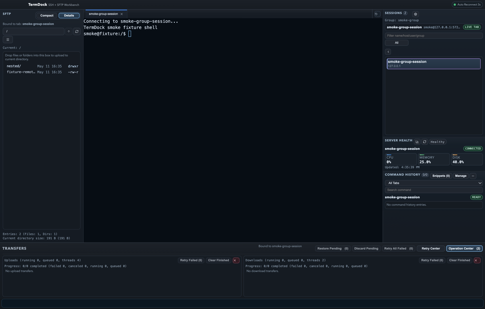
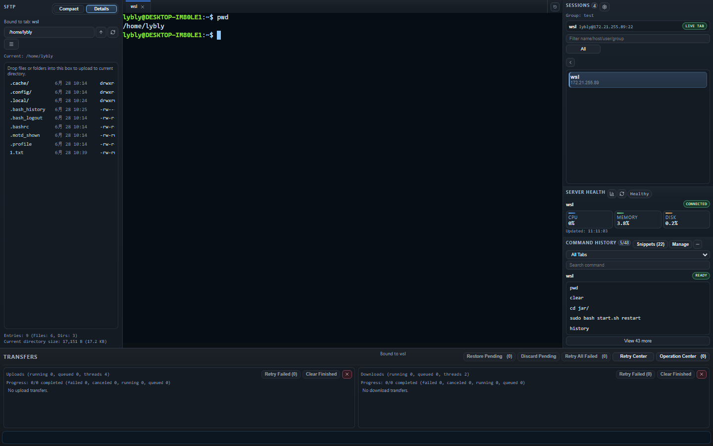
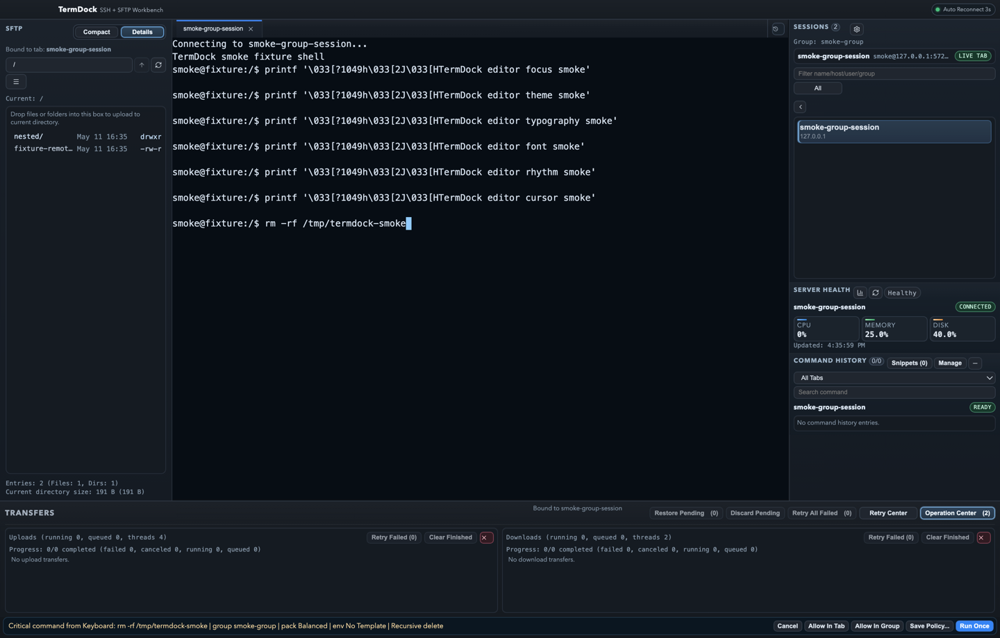
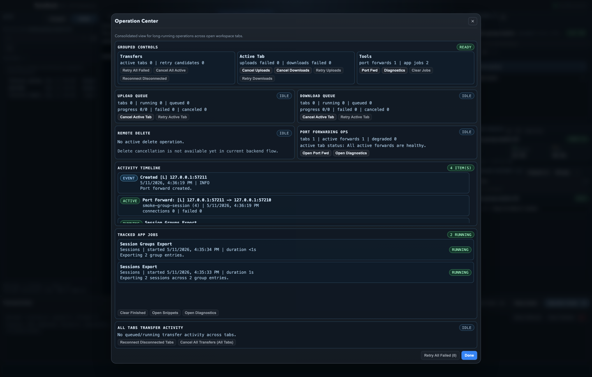
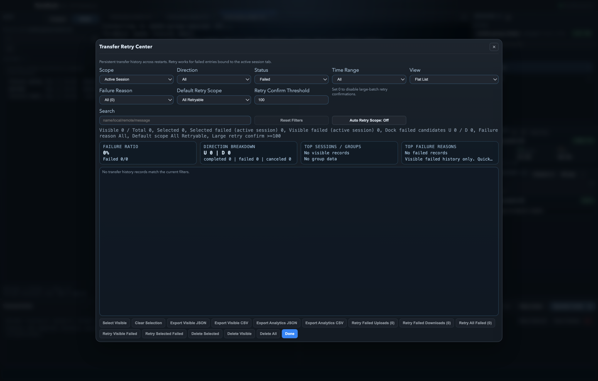
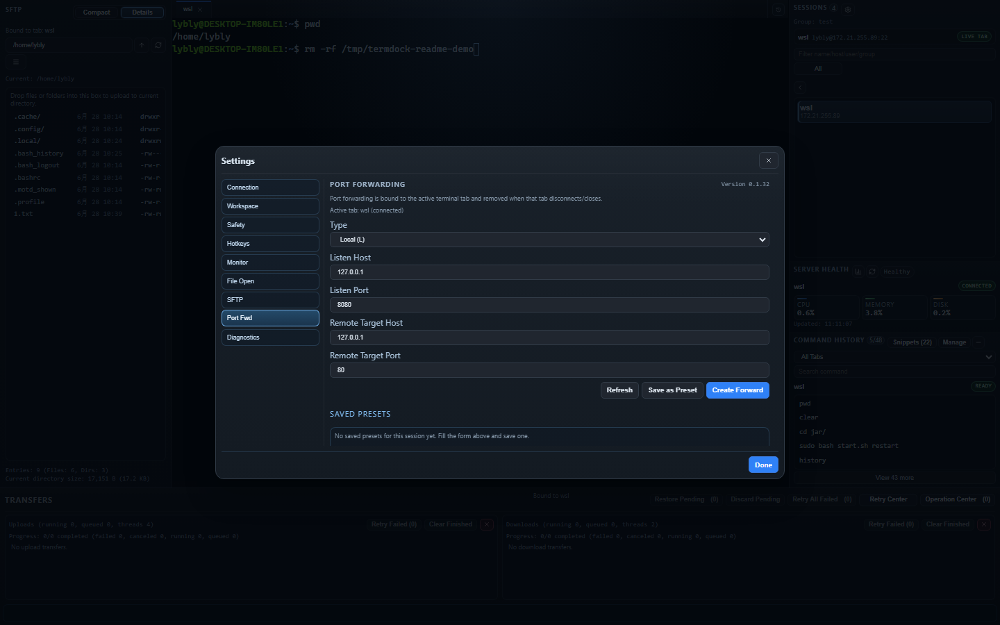

# TermDock

**A safer SSH + SFTP desktop workspace for developers and operators.**

TermDock helps you manage remote servers in one place: multi-tab SSH terminal, SFTP file transfer, server health monitoring, port forwarding, dangerous-command guardrails, transfer retry center, and diagnostics export.

[中文 README](README.zh-CN.md) · [Download](https://github.com/gongteng0215/TermDock/releases) · [SSH Config Import](docs/SSH_CONFIG_IMPORT.md) · [SSH Troubleshooting](docs/SSH_CONNECTION_TROUBLESHOOTING.md) · [Security](SECURITY.md) · [Contributing](CONTRIBUTING.md) · [Release Notes](RELEASE_NOTES.md)



## Why TermDock?

TermDock is not trying to be another giant terminal app. It is built as a practical server operations workspace for individual developers, small teams, and operators who frequently switch between SSH, SFTP, port forwarding, health checks, and recovery work.

- SSH + SFTP in one desktop app
- Multi-tab terminal for multiple servers
- Built-in server health panel: CPU, memory, disk, network, load, uptime
- Dangerous-command guardrails before risky operations
- Transfer queue, retry center, rate limits, and schedule windows
- Remote file open/edit with overwrite protection
- Port forwarding manager: Local, Remote, and Dynamic SOCKS5
- One-click diagnostics and bug report export

## Download

Get the latest build from [GitHub Releases](https://github.com/gongteng0215/TermDock/releases).

### Which File Should I Download?

| Platform | Recommended file | Use when |
| --- | --- | --- |
| Windows | `TermDock.Setup.*.exe` | You want the normal installer. |
| Windows | Windows `.zip` | You want a portable build without installation. |
| macOS Apple Silicon | macOS `arm64` `.dmg` or `.zip` | Your Mac uses Apple Silicon, such as M1/M2/M3/M4. |
| macOS Intel | macOS `x64` `.dmg` or `.zip` | Your Mac uses an Intel processor. |
| Source | Source code | You want to run or develop TermDock locally. |

TermDock is currently focused on macOS and Windows 11.

### First Launch Notes

- Download TermDock only from the official GitHub Releases page.
- Windows may show SmartScreen or publisher warnings for new open-source builds.
- macOS may show Gatekeeper warnings while public-trust signing/notarization is still in progress.
- If you are not sure which macOS CPU you have, check Apple menu -> About This Mac.

If the app cannot be installed or opened, see [Install And Launch Troubleshooting](docs/INSTALL_TROUBLESHOOTING.md).

## Screenshots

### Multi-Tab SSH Terminal


### SFTP File Browser



### Dangerous Command Guardrails



### Operation Center



### Retry Center



### Port Forwarding Manager



## Core Features

### SSH Workspace

- Password and private-key authentication
- Session create/edit/delete/test
- Folder-style session grouping, search, favorites, and recency sorting
- Multi-tab xterm terminal with reconnect flow
- SSH config import from `~/.ssh/config` with preview, duplicate handling, and post-import open action
- SSH connection errors include a plain-language reason, next-step suggestion, and raw error
- Session templates and quick startup command profiles

### SFTP Transfer

- Browse, create, rename, delete, upload, and download remote files
- Upload/download queues with per-task cancel and cancel-all actions
- Per-direction transfer rate limits
- Schedule windows for queued transfers
- Conflict policies: overwrite, skip, rename
- Pending queue restore after app restart
- Remote file open/edit with save-back conflict protection

### Safety And Recovery

- Dangerous-command approval bar before risky terminal writes
- Built-in and custom guardrail rules
- Per-source toggles for keyboard, paste, command history, snippets, quick profiles, and startup commands
- Temporary approvals for the current tab or session group
- Retry Center for failed transfer history and one-click requeue
- Recoverable global error bar with contextual actions

### Operations Tooling

- Server health panel for CPU, memory, disk, network, load, uptime, processes, and failed services
- Port forwarding manager for Local (`-L`), Remote (`-R`), and Dynamic SOCKS5 (`-D`) forwards
- Operation Center for active transfers, deletes, port forwards, diagnostics jobs, and reconnect actions
- Diagnostics logs, disconnect reports, and bug report `.zip` export

## Security Model

TermDock is designed as a local desktop app. It does not require a cloud account to manage servers.

- Session data is stored locally.
- Credentials use secure OS storage through the app credential layer where available.
- Session and group exports exclude decrypted credentials.
- Diagnostics and bug reports are generated locally for you to inspect before sharing.

See [SECURITY.md](SECURITY.md) for details and current limitations.

## Quick Start For Development

```bash
pnpm install
pnpm dev
```

Build the app:

```bash
pnpm build
```

Run the workspace smoke test:

```bash
pnpm run smoke:ui
```

The default smoke run boots an embedded local SSH/SFTP fixture, so core auth, terminal, SFTP, port-forwarding, settings, diagnostics, command history, retry, and operation-center flows can be verified without an external host.

## Project Structure

```txt
src/main       Electron main process, IPC, storage
src/renderer   React UI
src/shared     Shared contracts and types
docs/assets    README screenshots and product assets
```

## Status

- Current validation: `pnpm run typecheck`, `pnpm run build`, and `pnpm run smoke:ui` passed.
- Latest workspace smoke artifact: `artifacts/smoke/2026-05-13T05-57-03-338Z/summary.json` (`PASS 48 / FAIL 0 / SKIP 0`).
- Current packaging targets: macOS (`arm64`, `x64`) and Windows (`nsis`, `zip`).

For detailed progress, release validation, and planning notes, see:

- [Release Notes](RELEASE_NOTES.md)
- [Documentation Index](docs/DOCUMENTATION.md) / [中文](docs/DOCUMENTATION.zh-CN.md)
- [Progress Snapshot](PROGRESS.md) / [中文](PROGRESS.zh-CN.md)
- [Task Board](TASKS.md) / [中文](TASKS.zh-CN.md)
- [Packaged Smoke Runbook](PACKAGED_SMOKE.md) / [中文](PACKAGED_SMOKE.zh-CN.md)
- [Release Signing Runbook](RELEASE_SIGNING.md) / [中文](RELEASE_SIGNING.zh-CN.md)
- [UI Compact Rules](UI_COMPACT_RULES.md) / [中文](UI_COMPACT_RULES.zh-CN.md)
- [SSH Config Import](docs/SSH_CONFIG_IMPORT.md) / [中文](docs/SSH_CONFIG_IMPORT.zh-CN.md)
- [SSH Connection Troubleshooting](docs/SSH_CONNECTION_TROUBLESHOOTING.md) / [中文](docs/SSH_CONNECTION_TROUBLESHOOTING.zh-CN.md)
- [Install And Launch Troubleshooting](docs/INSTALL_TROUBLESHOOTING.md) / [中文](docs/INSTALL_TROUBLESHOOTING.zh-CN.md)
- [Feedback Triage](docs/FEEDBACK_TRIAGE.md) / [中文](docs/FEEDBACK_TRIAGE.zh-CN.md)
- [GitHub Labels](docs/GITHUB_LABELS.md) / [中文](docs/GITHUB_LABELS.zh-CN.md)
- [Contributing](CONTRIBUTING.md) / [中文](CONTRIBUTING.zh-CN.md)
- [60-Second Demo Script](docs/promotion/60-second-demo.md) / [中文](docs/promotion/60-second-demo.zh-CN.md)
- [GitHub Page Setup](docs/promotion/github-page-setup.md) / [中文](docs/promotion/github-page-setup.zh-CN.md)
- [Release Page Copy](docs/promotion/release-page-copy.md) / [中文](docs/promotion/release-page-copy.zh-CN.md)

## Known Limitations

- Data persistence is still JSON-based; SQLite migration is planned.
- No in-app auto-update yet.
- Public-trust signing/notarization evidence is still in progress.
- Active runtime port forwards are tab-scoped.
- Dynamic forwarding currently supports SOCKS5 no-auth `CONNECT` baseline.

## License

MIT
