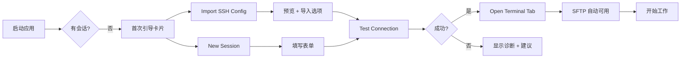
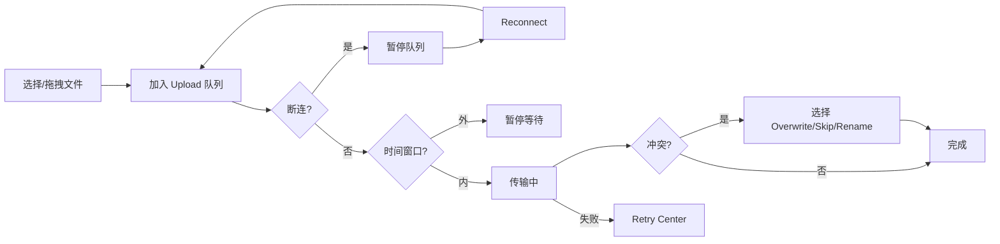
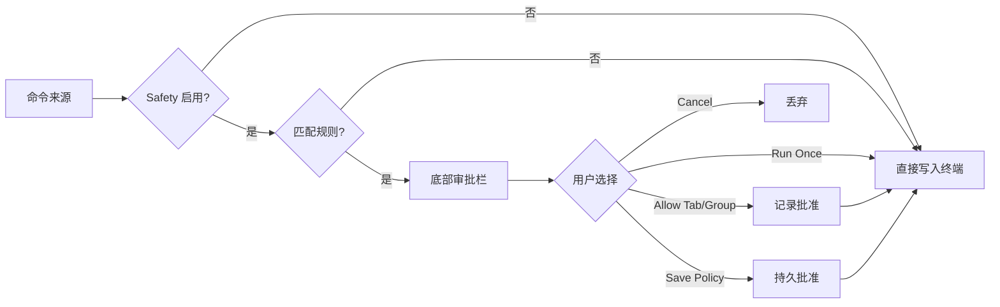

# TermDock UI 功能规格清单（原型设计用）

> **用途**：供 UI/UX 原型设计、信息架构梳理、页面拆分与交互标注使用。  
> **版本基准**：`v0.1.42`（2026-07-22）  
> **维护**：随产品迭代更新；英文 PRD 见 [PRD.zh-CN.md](../PRD.zh-CN.md)

---

## 目录

1. [产品概述](#1-产品概述)
2. [设计原则与 UX 约束](#2-设计原则与-ux-约束)
3. [信息架构与布局](#3-信息架构与布局)
4. [全局 UI 元素](#4-全局-ui-元素)
5. [会话管理（Sessions）](#5-会话管理sessions)
6. [SSH 终端（Terminal Stage）](#6-ssh-终端terminal-stage)
7. [SFTP 文件浏览器（Explorer）](#7-sftp-文件浏览器explorer)
8. [传输队列（Transfer Dock）](#8-传输队列transfer-dock)
9. [Retry Center（失败重试中心）](#9-retry-center失败重试中心)
10. [Operation Center（操作中心）](#10-operation-center操作中心)
11. [服务器健康（Server Health）](#11-服务器健康server-health)
12. [命令历史 & 命令片段](#12-命令历史--命令片段)
13. [会话模板 & 快捷配置](#13-会话模板--快捷配置)
14. [危险命令保护（Safety Guardrails）](#14-危险命令保护safety-guardrails)
15. [端口转发（Port Forwarding）](#15-端口转发port-forwarding)
16. [远程文件打开/编辑](#16-远程文件打开编辑)
17. [设置中心（Settings Modal）](#17-设置中心settings-modal)
18. [诊断、备份与更新](#18-诊断备份与更新)
19. [弹窗与对话框清单](#19-弹窗与对话框清单)
20. [上下文菜单完整清单](#20-上下文菜单完整清单)
21. [快捷键](#21-快捷键)
22. [主题、语言与密度](#22-主题语言与密度)
23. [数据模型与持久化](#23-数据模型与持久化)
24. [安全模型](#24-安全模型)
25. [用户流程图](#25-用户流程图)
26. [页面状态与边界情况](#26-页面状态与边界情况)
27. [已知限制](#27-已知限制)
28. [原型页面拆分建议](#28-原型页面拆分建议)
29. [组件树参考](#29-组件树参考)

---

## 1. 产品概述

### 1.1 定位

TermDock 是面向开发者与运维人员的 **本地优先（Local-first）桌面 SSH + SFTP 工作台**。在一个窗口内完成：

- 会话管理
- 多标签 SSH 终端
- SFTP 文件浏览与传输
- 服务器健康监控
- 传输失败恢复
- 危险命令审批
- 端口转发
- 诊断与备份

### 1.2 目标用户

- 后端 / 前端工程师
- SRE / 运维工程师
- 高频使用 SSH + 文件传输的个人开发者与小团队

### 1.3 目标平台

| 平台 | 支持程度 |
|------|----------|
| macOS（Apple Silicon / Intel） | 优先体验 |
| Windows 11 | 完整兼容 |

### 1.4 非目标（MVP 不做）

- 企业堡垒机 / 治理套件
- 云账号身份平台
- 移动端客户端

---

## 2. 设计原则与 UX 约束

| 原则 | 说明 |
|------|------|
| **紧凑优先** | 信息密度高于装饰性留白 |
| **Editor-Workbench 层级（Default）** | 终端 = 中心舞台；SFTP = Explorer；Sessions/Health/History = Inspector；传输 = 底部面板 |
| **Cockpit 层级（Tech）** | 顶栏 HUD；左 SFTP / 中终端+Transfer / 右三模块常显；底栏 Dock 导航与工具入口 |
| **上下文菜单优先** | 列表/树的高频操作优先放在右键菜单 |
| **破坏性操作强保护** | 删除、覆盖、危险命令等需确认 |
| **平台原生键盘习惯** | Windows 与 macOS 热键分别适配 |
| **Tab-scoped 状态** | 服务器健康、SFTP、端口转发、传输队列均跟随活动终端标签 |

### 2.1 视觉风格

- 深色 Editor-Workbench 风格（类 VS Code / Cursor 工作台）为 **Default** 壳
- **Tech** 壳为 Cockpit 控制台 IA（HUD + 四模块常显 + Dock），视觉为电路背景与青霓虹面板
- **壳层主题** Default / Tech + **5 种强调色** + **2 种布局密度**（三轴正交）
- 虚拟化长列表、按需加载重型弹窗

---

## 3. 信息架构与布局

壳层由 **Shell Theme** 决定布局骨架：

| Shell Theme | 布局 |
|-------------|------|
| **Default** | Editor-Workbench：左 Explorer / 中终端 / 右 Inspector（三 Tab）+ 底栏 Transfer |
| **Tech** | Cockpit 控制台：顶栏 HUD + 左 SFTP / 中终端+Transfer / 右 Sessions+Health+History **常显** + 底栏 Dock |

### 3.1 Default 主工作台结构

```
┌──────────────────────────────────────────────────────────────────┐
│ Topbar（仅 macOS）                                                │
│  · TermDock 品牌 + 副标题                                         │
│  · 自动重连状态点 + 文案                                           │
│  · 工作区 Profile 徽章（Dev/Staging/Prod/No Profile）              │
├─────────────┬────────────────────────────────┬─────────────────────┤
│ 左栏         │ 中央舞台                        │ 右栏 Inspector       │
│ SFTP        │ 多标签 SSH 终端（xterm.js）      │ Tab: Sessions       │
│ Explorer    │                                │ Tab: Health         │
│             │                                │ Tab: History        │
├─────────────┴────────────────────────────────┴─────────────────────┤
│ Transfer Dock（底部传输面板）                                      │
│  · 绑定标签提示 · 上传/下载队列 · Retry/Operation 入口              │
├──────────────────────────────────────────────────────────────────┤
│ App Inline Hint Panel                                            │
│  · 危险命令审批栏 · 全局提示消息                                    │
├──────────────────────────────────────────────────────────────────┤
│ Global Error Bar（有错误时显示）                                   │
└──────────────────────────────────────────────────────────────────┘
```

### 3.1b Tech（Cockpit）主工作台结构

```
┌──────────────────────────────────────────────────────────────────┐
│ Top HUD                                                          │
│  · Reconnect（对接活动标签重连 + 自动重连偏好展示）                   │
│  · Dangerous commands（打开 Settings → Safety）                  │
├─────────────┬────────────────────────────────┬─────────────────────┤
│ 左栏         │ 中央                           │ 右栏（三块常显）      │
│ SFTP FILES  │ Terminal（xterm）              │ Sessions            │
│             │ Transfer strip                 │ Server Health       │
│             │                                │ History / Operations│
├─────────────┴────────────────────────────────┴─────────────────────┤
│ Bottom Dock（8 键）                                               │
│  terminal · files · monitor · history · transfers                 │
│  retry · operations · settings                                    │
├──────────────────────────────────────────────────────────────────┤
│ App Inline Hint Panel / Global Error Bar（贴 Dock 上方）          │
└──────────────────────────────────────────────────────────────────┘
```

| Dock 项 | 行为 |
|---------|------|
| terminal / files / monitor / history / transfers | 聚焦对应模块（`module--focus`） |
| retry | 打开 Retry Center |
| operations | 打开 Operation Center |
| settings | 打开 Settings Modal |

实现入口：[`cockpit-workbench-shell.tsx`](../src/renderer/components/cockpit-workbench-shell.tsx)、[`cockpit-shell.css`](../src/renderer/styles/cockpit-shell.css)；`WorkbenchAppShell` 按 `uiThemeId === "tech"` 切换。

### 3.2 布局模式

| 模式 | 触发条件 | 行为 |
|------|----------|------|
| **常规模式** | 默认 | Default：三栏 + 底栏；Tech：四模块常显 + HUD/Dock |
| **Editor Focus 模式** | 活动终端进入 alternate-screen（vim/nano 等）且开启自动布局 | 收紧主布局，隐藏侧栏，终端占满中央（主要作用于 Default 壳） |

### 3.3 右栏 Inspector Tab（Default）

| Tab ID | 标签名 | 内容 |
|--------|--------|------|
| `sessions` | Sessions | 会话/分组浏览与管理 |
| `health` | Health | 服务器健康卡片 + 详情入口 |
| `history` | History | 命令历史列表 + Snippet 入口 |

窄屏时三个 Tab 合并为 Tab 切换；选中 Tab 持久化到 localStorage。**Tech 壳下不使用 Inspector Tab**：Sessions / Health / History 同时挂载。

### 3.4 设置入口

- **Sessions Inspector 标题栏**：Settings 图标按钮 → 打开 Settings Modal
- **Tech Bottom Dock → settings**：打开 Settings Modal
- **Tech Top HUD → Dangerous commands**：打开 Settings → Safety
- **Global Error Bar**：按错误类型跳转对应 Settings Section
- **各功能模块**：Operation Center / Retry Center 等提供跳转

---

## 4. 全局 UI 元素

### 4.1 Topbar（macOS only）

| 元素 | 说明 |
|------|------|
| 品牌 | `TermDock` + 副标题 |
| 状态点 | 自动重连开/关指示 |
| 自动重连文案 | `Auto reconnect: Ns` 或 `Auto reconnect off` |
| Profile 徽章 | 当前工作区环境（Dev/Staging/Prod/No Profile） |

### 4.2 Global Error Bar

**显示条件**：发生可恢复的全局错误。

| 区域 | 内容 |
|------|------|
| 错误消息 | 主错误文本 |
| 提示 | 下一步建议（hint） |
| 动作按钮 | 依上下文动态显示 |

**常见动作：**

| 动作 | 说明 |
|------|------|
| Reconnect | 重连活动终端 |
| Open Logs | 打开日志目录 |
| Export Bug Report | 导出诊断 zip |
| Copy Disconnect Report | 复制最新断连报告 |
| Copy Error | 复制错误文本 |
| Dismiss | 关闭错误条 |
| Open Connection/Safety/SFTP/... Settings | 跳转对应设置分区 |
| Open Operation Center | 打开操作中心 |
| Open Retry Center | 打开重试中心 |
| Open Snippet Manager | 打开片段管理 |
| Open Template Manager | 打开模板管理 |
| Open Command History Manager | 打开历史管理 |

### 4.3 App Inline Hint Panel

#### 4.3.1 危险命令审批栏

**显示条件**：终端写入被 Safety Guard 拦截。

| 区域 | 内容 |
|------|------|
| 严重级别 | `warn` / `critical` |
| 来源 | Keyboard / Paste / History / Snippet 等 |
| 命令预览 | 截断后的命令文本 |
| 规则摘要 | 匹配的规则说明 |
| 上下文 | 会话组、策略包、环境模板 |

| 动作 | 说明 |
|------|------|
| Cancel | 取消执行 |
| Run Once | 仅本次运行 |
| Allow In Tab | 允许此标签页（标签关闭时移除） |
| Allow In Group | 允许此会话分组（直到设置变更/重启/手动清除） |
| Save Policy | 保存为持久策略 |

#### 4.3.2 全局提示消息

- 级别：`info` / `warn`
- 自动消失（可配置时长）
- 手动 Dismiss

### 4.4 通用对话框（App Dialog）

| 类型 | 用途 |
|------|------|
| Alert | 单按钮提示 |
| Confirm | 确认/取消 |
| Choice | 多选项选择 |
| Prompt | 文本输入 |

---

## 5. 会话管理（Sessions）

### 5.1 Sessions Inspector 结构

```
Sessions Inspector
├── 标题栏
│   ├── 图标 + "Sessions" + 数量徽章
│   ├── 工作区 Profile 徽章
│   └── Settings 按钮
├── 位置副标题（Groups / Group: xxx）
├── 首次引导卡片（可选）
├── 活动上下文条（选中会话/分组时）
├── 过滤栏
│   ├── 搜索输入（Filter name/host/user/group）
│   └── All / Favorites 切换
└── 列表区
    ├── 分组视图：文件夹列表
    └── 会话视图：会话列表 + Back to Groups
```

### 5.2 首次引导卡片（First-run Card）

**显示条件**：无会话 + 未 dismiss + 非 loading。

| 元素 | 说明 |
|------|------|
| 标题 | Start with your first server |
| 描述 | 导入 SSH 配置或手动创建 |
| Import SSH Config | 主按钮 |
| New Session | 次按钮 |
| Security Notes | 次按钮 |
| 步骤提示 | 1. Import hosts → 2. Test connection → 3. Open terminal + SFTP |
| Dismiss | 关闭并持久化 |

### 5.3 会话数据模型

| 字段 | 类型 | 说明 |
|------|------|------|
| id | string | UUID |
| name | string | 显示名称 |
| host | string | 主机地址 |
| port | number | 端口，默认 22 |
| username | string | SSH 用户名 |
| authType | `password` \| `privateKey` | 认证类型 |
| privateKeyPath | string? | 私钥路径 |
| groupId | string? | 分组名 |
| remark | string? | 备注 |
| favorite | boolean | 是否收藏 |
| hasSecret | boolean | 是否已保存凭据（不含明文） |
| lastConnectedAt | ISO string? | 最近连接时间 |
| createdAt / updatedAt | ISO string | 时间戳 |

### 5.4 创建/编辑会话弹窗

**标题**：Create Session / Edit Session

#### 模板工具区

| 按钮 | 说明 |
|------|------|
| Apply Template... | 从已保存模板填充（需有模板） |
| Save as Template... | 将当前表单存为模板 |
| Manage Templates... | 打开模板管理弹窗 |
| 计数 | Saved templates N/60 |

#### 表单字段

| 字段 | 控件 | 占位/说明 |
|------|------|-----------|
| Name | text | prod-web-01 |
| Host | text | 10.0.10.31 |
| Port | number 1-65535 | 默认 22 |
| Username | text | ec2-user |
| Group | select | Ungrouped + 已有分组 |
| Auth Type | select | Password / Private Key |
| Private Key Path | text + Choose File | ~/.ssh/id_ed25519 |
| Password / Key Passphrase | password | 编辑时空白=保留原值 |
| Remark | text | web production host |

#### 底部动作

| 按钮 | 说明 |
|------|------|
| Cancel | 关闭 |
| Test Connection | 测试连接，显示 ok/error 结果 |
| Create Session / Save Changes | 提交 |

### 5.5 连接测试失败展示

结构化三部分：

1. **Plain-language reason**（人话原因）
2. **Next-step suggestion**（下一步建议）
3. **Raw error**（原始错误）

### 5.6 分组导航

| 交互 | 行为 |
|------|------|
| 单击分组 | 进入该分组会话列表 |
| 双击会话 | 打开终端标签 |
| 单击会话 | 选中（支持 Shift/Ctrl 多选） |
| Back to Groups | 返回分组列表 |
| 分组计数 | 每组显示会话数量 |

### 5.7 排序模式

| 模式 | 说明 |
|------|------|
| Default | 默认顺序 |
| Recent | 最近使用 |
| Name A-Z | 名称升序 |
| Name Z-A | 名称降序 |

### 5.8 SSH Config 导入

**入口**：上下文菜单 / 首次引导 / 会话根菜单

**流程**：

1. 读取 `~/.ssh/config`
2. 解析 Host 条目
3. 显示预览统计：
   - 可导入数量
   - 重复项数量
   - 缺失 IdentityFile 警告
   - 不支持 OpenSSH 指令 warning
4. 用户选择重复项策略：`Skip` / `Overwrite` / `Rename`
5. 可选：导入后打开首个会话
6. 执行导入

**解析字段**：hostAlias, name, host, port, username, authType, privateKeyPath, sourceLine

### 5.9 JSON 导入/导出

| 操作 | 格式 | 凭据 |
|------|------|------|
| Export All Sessions | JSON | **不含**解密凭据 |
| Export All Groups | JSON | 仅分组结构 |
| Import Sessions JSON | JSON | 支持重复项策略 |

### 5.10 加密迁移（`.tdmigration`）

| 操作 | 说明 |
|------|------|
| Export Encrypted Migration | 用户 passphrase 保护；可含密码、私钥 passphrase、私钥文件内容 |
| Import Encrypted Migration | 需输入 passphrase；支持重复项策略 |

### 5.11 应用备份（`.tdbackup`）

| 操作 | 说明 |
|------|------|
| Export App Backup | SQLite 状态 + 会话 + 可选加密凭据附件 |
| Import App Backup | 预览 → 确认 → 替换耐久表；可选恢复凭据 |

---

## 6. SSH 终端（Terminal Stage）

### 6.1 终端标签栏

| 元素 | 说明 |
|------|------|
| 标签页 | 会话名 + 连接状态指示 |
| 选中态 | 高亮当前标签 |
| 关闭按钮 | 单标签关闭 |
| 空状态 | Terminal workspace ready. Open a session tab to start. |

### 6.2 连接状态

| 状态 | 说明 | UI |
|------|------|-----|
| `connecting` | 正在连接 | 加载/重连提示 |
| `connected` | 已连接 | 正常终端 |
| `closed` | 已断开 | 断连提示 + 重连 |

### 6.3 终端渲染

- **引擎**：xterm.js + FitAddon + WebGL renderer
- **自适应**：窗口 resize 时 fit
- **Alternate-screen 检测**：进入 vim/nano 等触发 Editor Focus 模式

### 6.4 标签页上下文菜单

| 动作 | 禁用条件 |
|------|----------|
| Close Tab | — |
| Close Tabs to Left | 已是第一个 |
| Close Tabs to Right | 已是最后一个 |
| Close Other Tabs | 仅一个标签 |
| Close All Tabs | 无标签 |

### 6.5 终端内搜索

- 快捷键打开搜索对话框
- 输入文本 → 在当前终端标签内搜索
- 支持 Next/Previous（如已实现）

### 6.6 命令历史捕获

- 在终端标签中按 Enter 提交命令时自动记录
- 同步到 History Inspector
- 最大长度限制（命令字符数上限）
- 按标签隔离，支持跨标签搜索

### 6.7 启动命令（Startup Commands）

- 打开会话标签时自动执行
- 来源：Quick Profile / 模板 / 手动配置
- 受 Safety Guard 保护（如启用）

### 6.8 同会话重复打开

- 同一会话再次 Open → **聚焦已有标签**，不新建（除非 forceNewTab）

### 6.9 自动重连

| 设置 | 范围 |
|------|------|
| 开关 | Connection Settings |
| 延迟 | 1–60 秒 |
| 触发 | 终端标签意外关闭/断连 |

---

## 7. SFTP 文件浏览器（Explorer）

### 7.1 绑定关系

- **必须**有活动终端标签
- 复用该标签的 SSH 连接
- 无标签时：提示 "Open a terminal tab first..."

### 7.2 Explorer 结构

```
SFTP Explorer
├── 标题栏（绑定标签名）
├── 路径栏
│   ├── 路径输入
│   ├── Go Up
│   └── Refresh
├── 工具栏菜单按钮（Actions Menu）
├── 视图模式切换（Compact / Details）
├── 文件列表
│   ├── Compact：名称 + 类型图标 + 紧凑大小
│   └── Details：名称 + 修改时间 + 权限 + 链接数 + owner + group + 大小
├── 拖拽上传区（drop overlay）
├── 错误区 + 恢复动作
└── 删除进度提示
```

### 7.3 文件条目类型

| kind | 说明 |
|------|------|
| directory | 目录 |
| file | 文件 |
| symlink | 符号链接 |
| other | 其他 |

### 7.4 交互

| 交互 | 行为 |
|------|------|
| 单击 | 选中 |
| 双击目录 | 进入 |
| 双击文件 | Open File（外部编辑器） |
| 拖拽文件到 Explorer | 上传 |
| 路径栏 Enter | Go to Path |

### 7.5 文件操作

| 操作 | 入口 |
|------|------|
| Go to Path | 工具栏/右键 |
| Go Up | 工具栏/右键 |
| Refresh | 工具栏/右键 |
| New Folder | 工具栏/右键 |
| Upload File | 工具栏/右键/拖拽 |
| Download File | 右键/选中后工具栏 |
| Download Folder | 右键目录 |
| Rename | 工具栏/右键 |
| Delete | 工具栏/右键（危险） |
| Copy Path | 右键 |
| Open File | 右键文件/双击 |

### 7.6 传输冲突策略

当远程文件已存在：

| 策略 | 行为 |
|------|------|
| Overwrite | 覆盖 |
| Skip | 跳过 |
| Rename | 自动重命名 |
| Remember | 记住选择（可选） |

### 7.7 权限失败处理

- 明确提示：当前 SSH 用户无法写入路径
- 建议：修复服务器权限 / 上传到可写目录后用 sudo 移动
- 特权回写流程：stage → sudo install（见 §16）

### 7.8 路径特性

- 支持 `~` home 目录解析
- 显示权限字符串、owner、group

---

## 8. 传输队列（Transfer Dock）

### 8.1 结构

```
Transfer Dock
├── 标题 "Transfers" + 绑定标签
├── 通知区（info/warn）
├── 全局动作
│   ├── Restore Pending (N)
│   ├── Discard Pending
│   ├── Retry All Failed
│   ├── Retry Center
│   └── Operation Center (active count)
├── Upload Panel
│   ├── 标题：Uploads (running R, queued Q, threads T)
│   ├── Retry Failed / Clear Finished / Cancel All
│   ├── 进度摘要
│   ├── 暂停消息（断连/时间窗口）
│   └── 任务列表
└── Download Panel（结构同上）
```

### 8.2 单任务项

| 字段 | 说明 |
|------|------|
| 文件名 | |
| 方向 | upload / download |
| 进度 | 百分比/字节 |
| 状态 | queued / running / completed / failed / canceled |
| 时间 | 耗时 |
| Cancel | 单任务取消 |

### 8.3 传输状态

| 状态 | 说明 |
|------|------|
| queued | 排队中 |
| running | 传输中 |
| completed | 完成 |
| failed | 失败（进入 Retry Center 历史） |
| canceled | 已取消 |

### 8.4 队列暂停条件

| 条件 | 提示 |
|------|------|
| 终端断连 | Queue paused: terminal disconnected |
| 传输时间窗口外 | Queue paused: outside configured window |
| 窗口恢复 | 自动恢复 / 显示下次开放时间 |

### 8.5 应用重启恢复

| 动作 | 说明 |
|------|------|
| Restore Pending | 恢复上次 pending 队列 |
| Discard Pending | 丢弃 pending 队列 |

### 8.6 并发与限速（Settings → SFTP）

- Upload/Download 独立线程数
- Upload/Download 独立限速（KiB/s，0=不限）
- 见 §17.7

---

## 9. Retry Center（失败重试中心）

### 9.1 入口

- Transfer Dock → Retry Center 按钮
- Operation Center → Open Retry Center
- Global Error Bar

### 9.2 结构

```
Retry Center Modal
├── 标题 + 关闭
├── 描述
├── 筛选工具栏
│   ├── Scope: Active Session / All Sessions
│   ├── Direction: All / Upload / Download
│   ├── Status: All / Failed / Completed / Canceled
│   ├── Time Range
│   ├── List Mode: Flat / Grouped
│   ├── Failure Reason
│   ├── Search
│   └── Reset Filters
├── 分析面板
│   ├── 失败率
│   ├── 方向分布
│   ├── Top Sessions / Groups / Reasons
│   └── 修复建议
├── 列表（Flat 或 Grouped）
└── 批量动作栏
```

### 9.3 重试范围（Retry Scope）

| 范围 | 说明 |
|------|------|
| Visible | 当前筛选可见项 |
| Selected | 选中项 |
| All Failed | 所有失败候选 |
| By Reason | 按失败原因 |
| By Group | 按分组 |

### 9.4 批量动作

| 动作 | 说明 |
|------|------|
| Retry Failed Uploads | 重试失败上传 |
| Retry Failed Downloads | 重试失败下载 |
| Retry All Failed | 全部失败重试 |
| Retry Selected | 重试选中 |
| Retry Visible | 重试可见 |
| Clear Selected / Visible / All | 清除历史 |
| Select All Visible | 全选 |
| Export JSON/CSV | 导出历史/分析 |

### 9.5 分组视图

- 按会话或分组聚合
- 可 Expand All / Collapse All
- 组级：Select / Retry Failed / Clear / Export

### 9.6 批量确认阈值

- Settings → SFTP → Retry Confirm Threshold
- 超过 N 条批量重试时需二次确认

---

## 10. Operation Center（操作中心）

### 10.1 入口

- Transfer Dock → Operation Center（有活动时显示计数）

### 10.2 结构

```
Operation Center Modal
├── Grouped Controls（跨标签汇总）
│   ├── Transfers: Retry All Failed (All Tabs) / Retry All Failed / Cancel All Active
│   ├── Reconnect Disconnected Tabs
│   └── Cancel All Transfers (All Tabs)
├── Active Tab 区
│   ├── Upload Queue: Cancel / Retry
│   ├── Download Queue: Cancel / Retry
│   ├── Remote Delete: Cancel Delete
│   └── Port Forwarding Ops: Stop Active Tab Forwards
├── All Tabs Transfer Activity
│   └── 每标签摘要 + Focus / Reconnect / Cancel / Retry
├── Port Forwarding Ops
├── Tracked App Jobs
├── Activity Timeline
└── 快捷入口: Port Fwd / Diagnostics / Retry Center / Snippets
```

### 10.3 状态徽章

| 状态 | 说明 |
|------|------|
| Ready | 有待处理操作 |
| Idle | 无活动 |
| Running / Working | 进行中 |
| Canceling / Reconnecting | 过渡态 |

### 10.4 App Jobs

后台任务类型（迁移、诊断导出等）：

| 字段 | 说明 |
|------|------|
| category | 任务类别 |
| startedAt | 开始时间 |
| duration | 持续时间 |
| output path | 输出路径 |
| Cancel / Copy Path | 动作 |

---

## 11. 服务器健康（Server Health）

### 11.1 Health Inspector（右栏 Tab）

**跟随活动终端标签**，不跨标签串扰。

| 元素 | 说明 |
|------|------|
| 绑定标签 | Active tab: xxx (connected/disconnected) |
| 刷新按钮 | 手动刷新 |
| 详情按钮 | 打开 Server Health Detail Modal |
| 告警文案 | Threshold reached: CPU/Memory/Disk |
| 卡片 | CPU / Memory / Disk 三卡片 |
| 更新时间 | Updated: ... · refreshing... |
| 空态 | Connect the active terminal tab... |

### 11.2 指标卡片

| 卡片 | 主值 | 附加 |
|------|------|------|
| CPU | 使用率 % | 超阈值高亮 |
| Memory | 使用率 % | 已用/总量 |
| Disk | 使用率 % | 超阈值高亮 |

### 11.3 详情弹窗 Tab

| Tab | 内容 |
|-----|------|
| **Overview** | CPU 核心数、Load、Memory、Swap、Uptime、Kernel |
| **Disk** | 各挂载点：路径、总量、已用、可用、使用率 |
| **Network** | 网卡：名称、RX/TX 字节 |
| **Processes** | Top 进程：PID、名称、CPU%、MEM% |
| **Services** | 失败服务：unit、状态、描述 |

### 11.4 告警阈值（Settings → Monitor）

| 指标 | 范围 | 默认行为 |
|------|------|----------|
| CPU Alert | 50–100% | 超阈值卡片高亮 + Inspector 告警文案 |
| Memory Alert | 50–100% | 同上 |
| Disk Alert | 50–100% | 同上 |

---

## 12. 命令历史 & 命令片段

### 12.1 History Inspector（右栏 Tab）

| 元素 | 说明 |
|------|------|
| 绑定标签 | 活动标签名 |
| 范围选择 | Active Tab / All Tabs |
| 搜索框 | Search command |
| 可见计数 | N visible (M hidden) |
| 列表 | 命令条目，双击运行 |
| 折叠/展开 | Collapse/Expand panel |
| Open Manager | 打开管理弹窗 |
| Open Snippets | 打开片段管理 |

### 12.2 命令历史条目

| 字段 | 说明 |
|------|------|
| id | 唯一 ID |
| command | 命令文本 |
| source | 来源标签 |
| timestamp | 记录时间 |

### 12.3 Command History Manager 弹窗

| 功能 | 说明 |
|------|------|
| 浏览/搜索 | 全部历史 |
| 删除 | 单条/批量 |
| 导入 JSON | 支持多种格式 |
| 导出 JSON | |
| 从 Inspector 同步 | |

**支持导入格式：**

- `["cmd1", "cmd2"]`
- `{ commands: [] }`
- `{ entries: [{ command }] }`

### 12.4 Command Snippet Manager 弹窗

#### 结构（三栏或分步）

```
Snippet Manager
├── 分组列表（左）
├── Snippet 列表（中）
└── 编辑区（右）
    ├── Snippet 名称
    ├── 命令模板（含 {{变量}}）
    ├── Confirm before run
    ├── Preview before run
    ├── Prompt Set 选择
    └── 参数列表
```

#### 数据模型

| 实体 | 字段 |
|------|------|
| Group | id, name, snippets[] |
| Snippet | id, name, template, confirmBeforeRun, previewBeforeRun, promptSetId |
| Prompt Set | id, name, parameters[] |
| Parameter | key, label, defaultValue, scope |
| Scoped Value | scopeId + key → value |

#### 变量作用域

| Scope | 说明 |
|-------|------|
| snippet | 片段级 |
| group | 分组级 |
| session | 会话级 |
| global | 全局 |

#### 动作

| 动作 | 说明 |
|------|------|
| Add/Delete Group | |
| Add/Delete Snippet | |
| Run Selected / Run | 运行（可触发 Safety 审批） |
| Import/Export JSON | |
| Clear Scoped Values | |
| Clear All | |
| 校验提示 | invalid pattern / missing keys / shadowed keys / unused keys |

#### 上限

- 分组数 / 每组 snippet 数 / prompt set 数 / 参数数 均有上限

---

## 13. 会话模板 & 快捷配置

### 13.1 Session Template（会话模板）

**上限**：60 个

#### 模板字段

| 字段 | 说明 |
|------|------|
| templateName | 模板名 |
| sessionName, host, port, username | 连接信息 |
| authType, privateKeyPath | 认证 |
| groupId, remark, favorite | 元数据 |
| secret | 密码/passphrase |
| envVars[] | 环境变量 preset（key/value） |

#### 入口

- 创建/编辑会话弹窗 → Template Tools
- 上下文菜单 → Save as Session Template / Manage / New From Template
- Session Template Manager 弹窗

#### Session Template Manager 弹窗

| 区域 | 说明 |
|------|------|
| 模板列表 | 选择已有模板 |
| 编辑表单 | 同创建会话字段 + env vars |
| Use Current Form | 从当前会话表单导入 |
| Use Editing Template | 加载选中模板 |
| Delete | 删除模板 |
| 上限提示 | N/60 |

### 13.2 Quick Profile（快捷配置）

**上限**：80 个

| 字段 | 说明 |
|------|------|
| name | 配置名 |
| startupCommand | 启动命令（最长 4000 字符） |
| 关联会话 | 绑定到特定 session |

#### 入口（会话上下文菜单）

| 动作 | 说明 |
|------|------|
| Save Quick Profile... | 保存当前命令为快捷配置 |
| Manage Quick Profiles... | 管理列表 |
| Run Quick Profile... | 选择并执行 |

#### 执行行为

- 打开或聚焦会话标签
- 执行 startupCommand
- 受 Safety Guard 保护

---

## 14. 危险命令保护（Safety Guardrails）

### 14.1 总览

在命令写入终端前拦截，使用 **底部固定审批栏**（非模态弹窗）。

### 14.2 执行来源（7 种）

| ID | 标签 | 说明 |
|----|------|------|
| keyboard | Keyboard | Enter 提交缓冲命令 |
| clipboard | Clipboard Paste | 多行粘贴 |
| commandHistoryRun | History Run | 从历史直接运行 |
| commandHistoryPaste | History Paste | 粘贴历史到终端 |
| snippet | Snippet | 片段/playbook 执行 |
| startupCommand | Startup Command | 标签打开时启动命令 |
| quickProfile | Quick Profile | 快捷配置命令 |

每种来源可独立启用/禁用。

### 14.3 内置规则（5 条）

| ID | 标签 | 严重级别 | 匹配示例 |
|----|------|----------|----------|
| recursiveDelete | Recursive delete | critical | rm -rf, Remove-Item -Recurse -Force |
| diskOverwrite | Raw disk overwrite | critical | dd of=/dev/..., diskpart |
| formatDisk | Disk format / partition | critical | mkfs, fdisk, format C: |
| systemShutdown | Shutdown / reboot | warn | shutdown, reboot, systemctl poweroff |
| privilegedSystemWrite | Privileged system path write | warn | 写入 /etc, /usr, C:\Windows |

### 14.4 策略包（Policy Pack）

| ID | 标签 | 额外规则 |
|----|------|----------|
| balanced | Balanced | 无（仅内置规则） |
| operations | Operations | 服务停止/重启、容器/K8s 删除 |
| strict | Strict | 上述 + Terraform destroy、DROP DATABASE 等 |

**Operations 额外规则：**

- Service stop / restart（systemctl, service, sc）
- Container / cluster destructive（kubectl delete, docker prune 等）

**Strict 额外规则（含 Operations）：**

- Infrastructure destroy（terraform/terragrunt/pulumi destroy）
- Database drop / truncate（DROP DATABASE, TRUNCATE, redis FLUSH）

### 14.5 环境模板（Environment Template）

| ID | 标签 | 推荐策略包 | 额外规则 |
|----|------|------------|----------|
| none | No Template | balanced | 无 |
| dev | Development | balanced | 无 |
| staging | Staging | operations | Rollout/process restart |
| prod | Production | strict | Production restart + Framework reset |

### 14.6 自定义规则

- 文本框输入正则模式（每行一条）
- 最大长度 1600 字符
- 无效行计数提示

### 14.7 会话组覆盖（Group Override）

- 按会话分组保存 policy pack + environment template 组合
- 匹配分组时 **替换** 全局 pack/template（仅该标签）
- 上限 40 组
- 保存/删除/列表管理

### 14.8 批准管理

| 类型 | 范围 | 生命周期 |
|------|------|----------|
| Temporary（Allow In Tab） | 单标签 | 标签关闭时移除 |
| Temporary（Allow In Group） | 会话分组 | 设置变更/重启/手动清除 |
| Persistent | global / sessionGroup | 持久保存，上限 120 条 |

### 14.9 策略包 Bundle

- 保存当前 Safety 配置为 Bundle
- 导入/导出 JSON
- 可选文件同步（Pull/Push）
- 应用/删除 Bundle

### 14.10 工作区 Profile 联动

| Profile | Safety 默认 |
|---------|-------------|
| No Profile | 不强制 |
| Dev | Development + Balanced |
| Staging | Staging + Operations |
| Prod | Production + Strict |

可选 **Sync global Safety pack/template to workspace profile**。

---

## 15. 端口转发（Port Forwarding）

### 15.1 类型

| 类型 | SSH 参数 | 表单字段 |
|------|----------|----------|
| Local (L) | -L | Listen Host/Port → Remote Target Host/Port |
| Remote (R) | -R | Listen Host/Port → Local Target Host/Port |
| Dynamic (D) | -D SOCKS5 | Listen Host/Port（无 target） |

### 15.2 生命周期

- **绑定活动终端标签**
- 标签断连/关闭 → 转发移除
- 状态：`active` / `degraded`

### 15.3 Settings → Port Fwd 结构

```
Port Forwarding Settings
├── 活动标签摘要
├── 创建表单（Type / Listen / Target）
├── 动作：Refresh / Save as Preset / Create Forward
├── Saved Presets 列表
│   ├── Auto restore on connect
│   ├── Fill Form / Apply / Delete
├── Active Forwards 列表
│   ├── 状态徽章、连接数、最后活动、错误
│   └── Remove
├── Refresh Diagnostics / Export Snapshot
└── Event History
    ├── 筛选：Filter / Time / Error Code / Correlation
    ├── 分析：错误率、类型分布、Top Error Codes
    └── Export JSON/CSV / Clear
```

### 15.4 预设（Preset）

| 字段 | 说明 |
|------|------|
| name | 预设名 |
| type, bindHost, bindPort, targetHost, targetPort | 转发配置 |
| autoRestore | 连接时自动恢复 |
| updatedAt | 更新时间 |

### 15.5 事件历史

| 字段 | 说明 |
|------|------|
| type | created / connected / error / closed |
| level | info / error |
| message | 事件消息 |
| correlation | 关联 ID |
| timestamp | 时间 |

### 15.6 已知限制

- Dynamic forwarding：SOCKS5 no-auth CONNECT 基线
- 运行中转发按标签页管理

---

## 16. 远程文件打开/编辑

### 16.1 流程

```
Open File
  → 下载到本地 temp
  → 用外部程序打开（Settings → File Open 配置）
  → 用户编辑
  → 保存时检测本地变更
  → 回传远程（SFTP upload）
  → 元数据基线比对（防静默覆盖）
```

### 16.2 防重复

- 同一远程文件不重复打开
- 已打开时聚焦已有草稿

### 16.3 草稿状态

| 状态 | 说明 |
|------|------|
| modified | 本地有未同步修改 |
| syncing | 正在回传 |

### 16.4 关闭/清理

- 标签关闭或应用退出 → 清理 temp 文件

### 16.5 特权路径回写

**场景**：SFTP 无法直接写入系统路径。

```
Save Failed (permission-denied)
  → Stage 到 ~/termdock-staging
  → 提示 sudo install 命令
  → 用户选择：Copy sudo Command / Paste into Terminal / Later
```

### 16.6 Settings → File Open

| 字段 | 说明 |
|------|------|
| Open Program or Command | 外部编辑器路径或命令 |
| Browse | 文件选择 |
| 空值 | 使用系统默认应用 |

**示例：**

- macOS: `/Applications/TextEdit.app`
- Windows: `code --reuse-window` 或完整 exe 路径

---

## 17. 设置中心（Settings Modal）

### 17.1 结构

```
Settings Modal
├── 左侧导航（10 Section）
├── 右侧内容区
└── 底部：Version x.x.x + Done
```

### 17.2 Section 导航

| ID | 导航名 | 标题 |
|----|--------|------|
| connection | Connection | Connection |
| workspace | Workspace | Workspace Profile |
| safety | Safety | Safety Guardrails |
| hotkeys | Hotkeys | Hotkeys |
| serverHealth | Monitor | Server Health Alerts |
| fileOpening | File Open | File Opening |
| sftp | SFTP | SFTP Transfers |
| portForwarding | Port Fwd | Port Forwarding |
| diagnostics | Diagnostics | Diagnostics |

---

### 17.3 Connection

| 控件 | 类型 | 说明 |
|------|------|------|
| Auto reconnect disconnected tabs | checkbox | 意外断连后自动重连 |
| Reconnect Delay (seconds) | number 1–60 | 重连延迟 |

---

### 17.4 Workspace

| 分组 | 选项 |
|------|------|
| **Interface Language** | English / 简体中文 |
| **Shell Theme** | Default / Tech（壳层风格语言；与强调色正交） |
| **Accent Color** | Ocean / Lavender / Mint / Amber / Rose |
| **Layout Density** | Compact / Comfortable |
| **Workspace Profile** | No Profile / Development / Staging / Production |
| Sync Safety to Profile | checkbox |
| **Terminal Editor Focus** | Auto-focus alternate-screen editors |
| **Editor Theme** | Midnight / Graphite / Paper |
| **Editor Typography** | Compact / Balanced / Reading |
| **Editor Font** | System Mono / Coding Mono / Drafting Mono |
| **Editor Text Rhythm** | Crisp / Steady / … |
| **Editor Cursor** | Bar / Block / … |

---

### 17.5 Safety

见 [§14 危险命令保护](#14-危险命令保护safety-guardrails) 全部配置项。

---

### 17.6 Hotkeys

| 动作 ID | 描述 | 默认（Windows） | 默认（macOS） |
|---------|------|-----------------|---------------|
| openSessionTab | Open selected session in new tab | — | — |
| closeActiveTab | Close active terminal tab | — | — |
| terminalCopy | Terminal copy | Ctrl+Shift+C | Cmd+C |
| terminalPaste | Terminal paste | Ctrl+Shift+V | Cmd+V |
| terminalSearch | Search in terminal | Alt+Shift+F | Cmd+F |

**每项可配置：**

- Enabled checkbox
- Modifier select
- Key input（A-Z 单键）
- Conflict badge + 冲突导航

**批量动作：**

- Import Hotkeys / Export Hotkeys / Reset Hotkeys
- Resolve Conflicts

---

### 17.7 SFTP Transfers

| 控件 | 说明 |
|------|------|
| Upload Threads | 上传并发数 |
| Download Threads | 下载并发数 |
| Upload Limit (KiB/s) | 上传限速，0=不限 |
| Download Limit (KiB/s) | 下载限速 |
| Restrict to schedule window | 传输时间窗口开关 |
| Window Start / End | 时段 |
| 星期选择 | Mon–Sun 多选 |
| Schedule Presets | 预设模板一键应用 |
| Retry Confirm Threshold | 批量重试确认阈值 |
| Clear Upload/Download/All Defaults | 清除会话级覆盖 |
| **Transfer Policy Packs** | 保存/导入/导出/同步传输策略 |

---

### 17.8 Monitor（Server Health Alerts）

| 控件 | 范围 |
|------|------|
| Enable threshold alerts | checkbox |
| CPU Alert (%) | 50–100 |
| Memory Alert (%) | 50–100 |
| Disk Alert (%) | 50–100 |

---

### 17.9 File Open

见 [§16.6](#166-settings--file-open)

---

### 17.10 Port Fwd

见 [§15.3](#153-settings--port-fwd-结构)

---

### 17.11 Diagnostics

见 [§18 诊断、备份与更新](#18-诊断备份与更新)

---

## 18. 诊断、备份与更新

### 18.1 日志

| 项 | 说明 |
|----|------|
| Log Directory | 只读路径 |
| Log File | 当前日志文件 |
| Refresh / Open Folder / Copy Path | 动作 |

### 18.2 Bug Report

- Export Bug Report → `.zip`
- 包含：日志、运行时元数据、安全设置快照（不含凭据）

### 18.3 自动更新

| 状态 | 说明 |
|------|------|
| disabled | 不可用 |
| idle | 空闲 |
| checking | 检查中 |
| available | 有新版本 |
| not-available | 已是最新 |
| downloaded | 已下载待安装 |
| error | 出错 |

| 元素 | 说明 |
|------|------|
| Current version | 当前版本 |
| Latest version | 最新版本 |
| Download progress | 下载进度 % |
| Ready to Install | 重启安装提示 |
| Last checked | 上次检查时间 |
| Check for Updates | 手动检查 |

### 18.4 App Backup（`.tdbackup`）

| 操作 | 说明 |
|------|------|
| Export | 会话 + SQLite 耐久状态 + 可选加密凭据 |
| Import | 预览 → 确认 → 应用；可选 duplicate strategy |

### 18.5 断连报告（Disconnect Reports）

| 控件 | 选项 |
|------|------|
| Auto capture | checkbox |
| Scope | All Sessions / Active Session |
| Trigger | All / Status / Error |
| Time | All / 5m / 30m / 1h / 24h |
| Search | session/target/message |

| 动作 | 说明 |
|------|------|
| Export Visible JSON/CSV | |
| Copy Latest Visible | |
| Clear Visible / Clear All | |
| Focus Tab | 跳转到对应标签 |
| Copy Report JSON | 单条复制 |

**报告字段：**

- session, target, trigger, status, message, failure samples, timestamp

---

## 19. 弹窗与对话框清单

| # | 名称 | 类型 | 触发 |
|---|------|------|------|
| 1 | Create/Edit Session | Modal | New Session / Edit / 首次引导 |
| 2 | Session Template Manager | Modal（懒加载） | Template Tools / 上下文菜单 |
| 3 | Command History Manager | Modal（懒加载） | History Inspector / 上下文菜单 |
| 4 | Command Snippet Manager | Modal（懒加载） | History / Operation Center |
| 5 | Server Health Detail | Modal | Health Inspector → 详情 |
| 6 | Operation Center | Modal（懒加载） | Transfer Dock |
| 7 | Retry Center | Modal（懒加载） | Transfer Dock / Error Bar |
| 8 | Settings | Modal | Sessions Settings 按钮 |
| 9 | Move to Group | Modal | 会话上下文菜单 |
| 10 | App Dialog (Alert/Confirm/Choice/Prompt) | Modal | 全局 |
| 11 | SSH Config Import Preview | App Dialog | 导入流程 |
| 12 | Transfer Conflict | App Dialog | 传输冲突 |
| 13 | Terminal Search | Inline Dialog | 快捷键 |
| 14 | sudo Required | App Choice | 特权回写失败 |
| 15 | Hotkey Import Preview | App Dialog | 快捷键导入 |
| 16 | Backup Import Preview | App Dialog | 备份导入 |
| 17 | Migration Import | App Dialog + Passphrase | 加密迁移 |
| 18 | Quick Profile Prompt | App Prompt | 保存/编辑快捷配置 |
| 19 | Dangerous Command Approval | **Bottom Bar**（非 Modal） | Safety 拦截 |

---

## 20. 上下文菜单完整清单

### 20.1 会话根区域（Group Root / Group View Root）

**导入导出：**

- Import SSH Config...
- Import Sessions JSON...
- Import Encrypted Migration...
- Import App Backup...
- Export All Sessions...
- Export Encrypted Migration...
- Export App Backup...
- Export All Groups...

**模板：**

- New Session From Template... (N)
- Manage Session Templates...

**分组/会话：**

- New Group / New Session
- Select All Groups / Clear Group Selection
- Select All Sessions / Clear Session Selection
- Rename Group / Delete Group
- Back to Groups（会话视图）

**排序：**

- Sort: Default / Recent / Name A-Z / Name Z-A（当前项标注 Current）

### 20.2 单会话

- Open Terminal Tab
- View Details
- Favorite / Unfavorite
- Copy Clash Direct Rules
- Copy SSH Command
- Edit Session / Duplicate Session
- Save as Session Template...
- Save Quick Profile... / Manage Quick Profiles... / Run Quick Profile...
- Move to Group... / Move to Ungrouped
- Delete Session

### 20.3 多选会话

- Open N Selected Tabs
- Move Selected to Group... / Move Selected to Ungrouped
- Delete N Selected

### 20.4 单分组

- Open Group
- New Session / New Group
- Rename Group / Delete Group

### 20.5 SFTP 工具栏菜单

- Go to Path / Go Up / Refresh
- New Folder / Upload File
- Download Selected / Rename Selected / Delete Selected（danger）

### 20.6 SFTP 条目右键

**目录：**

- Open Directory / Download Folder

**文件：**

- Open File / Download File

**通用：**

- Upload File / New Folder / Refresh
- Rename / Delete
- Copy Path / Copy Current Path

### 20.7 终端标签右键

- Close Tab / Close Tabs to Left / Close Tabs to Right / Close Other Tabs / Close All Tabs

### 20.8 命令历史条目右键

- Run / Copy / Delete（danger）/ Close

### 20.9 命令历史面板空白右键

- Add / Import / Export
- Run Snippet / Snippet Manager / Manage / Close

---

## 21. 快捷键

### 21.1 可配置动作（5 个）

见 [§17.6 Hotkeys](#176-hotkeys)

### 21.2 修饰键选项

- Primary（Windows: Ctrl / macOS: Cmd）
- Alt / Alt+Shift / Ctrl+Shift 等

### 21.3 冲突处理

- 导入时检测冲突
- 设置页显示 Conflict badge
- Resolve Conflicts / 自动禁用重复动作

---

## 22. 主题、语言与密度

壳层外观由 **三轴正交** 控制，组合靠 CSS 层叠，不做 Theme × Accent 笛卡尔积：

| 轴 | DOM | 职责 | 持久化 |
|----|-----|------|--------|
| **Shell Theme** | `html[data-ui-theme]` | 底盘色、边框语言、glow、圆角、UI 字体气质 | `localStorage` `termdock.ui-theme.v1` |
| **Accent** | `html[data-ui-accent]` | `--accent*` 色相及选中/焦点染色 | `termdock.ui-accent.v1` |
| **Density** | `html[data-ui-density]` | `--density-*` 间距 | `termdock.ui-density.v1` |

实现入口：[`src/renderer/styles/themes.css`](../src/renderer/styles/themes.css)、[`src/renderer/ui-theme.ts`](../src/renderer/ui-theme.ts)。Settings → Workspace → **Shell Theme**（在 Accent 上方）。

### 22.1 语言

| ID | 标签 |
|----|------|
| en | English |
| zh-CN | 简体中文 |

界面文案、选项描述、错误消息均支持切换。

### 22.2 壳层主题（Shell Theme）

| ID | EN | 中文 | 说明 |
|----|-----|------|------|
| default | Default | 默认 | Editor-Workbench 壳层（Topbar + 三栏 + Inspector Tab + Transfer Dock） |
| tech | Tech | 科技风 / Cockpit | Cockpit 浮动霓虹面板 + Top HUD + Bottom Dock；**面板外空隙透明透出桌面**（Electron 透明窗；Windows 用隐藏标题栏 + 系统按钮避免白屏） |

切换主题后，Sessions / SFTP / Terminal chrome / Transfer Dock / Settings / Modal / 审批栏 / Error Bar 应同气质；再切 Accent，仅色相变化。**切回 Default 完整恢复 Editor-Workbench IA**，业务数据与 IPC 不丢。

**本期不做：** xterm / Editor Focus 配色跟壳主题联动、亮色主题、主题写入 SQLite / `.tdbackup`、原型定稿 scale 画布。

### 22.3 强调色（Accent）

| ID | EN | 中文 |
|----|-----|------|
| ocean | Ocean | 海洋蓝 |
| lavender | Lavender | 淡紫色 |
| mint | Mint | 薄荷绿 |
| amber | Amber | 琥珀橙 |
| rose | Rose | 玫瑰粉 |

在 Default / Tech 两种壳主题下均可换色；影响 surface 染色、border、selection、primary action。

### 22.4 布局密度

| ID | 说明 |
|----|------|
| compact | 侧栏/列表更紧凑（默认） |
| comfortable | 更宽松，传输面板文字更大 |

### 22.5 Editor Focus 主题（独立于 Shell）

| 维度 | 选项 |
|------|------|
| Theme | Midnight / Graphite / Paper |
| Typography | Compact / Balanced / Reading |
| Font | System Mono / Coding Mono / Drafting Mono |
| Rhythm | Crisp / Steady / … |
| Cursor | Bar / Block / … |

仅影响 alternate-screen 编辑模式下的活动标签；与壳层 Theme 轴无关。

---

## 23. 数据模型与持久化

### 23.1 存储架构

| 数据 | 存储 |
|------|------|
| 会话 | SQLite（权威） |
| 凭据 | OS 安全存储（keytar） |
| 偏好设置 | SQLite + JSON 双写（耐久） |
| 传输历史 | SQLite |
| 命令历史 | localStorage + 同步 |
| Snippets/Templates | localStorage / SQLite |
| UI 偏好 | localStorage（语言、密度、Inspector Tab 等） |

### 23.2 导出格式

| 格式 | 扩展名 | 凭据 |
|------|--------|------|
| Sessions JSON | .json | 不含 |
| Encrypted Migration | .tdmigration | 加密含 |
| App Backup | .tdbackup | 可选加密附件 |
| Hotkeys | .json | — |
| Snippets | .json | — |
| Policy Bundles | .json | — |
| Transfer Policy Packs | .json | — |
| Bug Report | .zip | 不含 |
| Disconnect Reports | .json / .csv | — |
| Port Forward Events | .json / .csv | — |

---

## 24. 安全模型

| 原则 | 说明 |
|------|------|
| 本地优先 | 无需云账号 |
| 凭据隔离 | OS keychain/credential manager |
| 导出安全 | 普通 JSON 不含解密凭据 |
| 加密迁移 | 用户 passphrase 保护 |
| 诊断安全 | Bug report 本地生成，用户决定分享 |
| 危险命令 | 写入前审批，可配置规则与覆盖 |
| 特权回写 | sudo 命令由用户手动确认执行 |

---

## 25. 用户流程图

### 25.1 首次使用



### 25.2 文件上传



### 25.3 危险命令



---

## 26. 页面状态与边界情况

### 26.1 空状态

| 区域 | 空态文案/行为 |
|------|---------------|
| Sessions | 首次引导卡片 / Loading sessions... |
| Terminal | Terminal workspace ready... |
| SFTP | 需先打开终端标签 |
| Health | Connect the active terminal tab... |
| History | No active terminal tab / 无记录 |
| Transfer Upload/Download | No upload/download transfers. |
| Port Forwards | No active port forwards for the current tab. |
| Retry Center | 无历史记录 |
| Operation Center | No activity yet |

### 26.2 加载状态

| 区域 | 表现 |
|------|------|
| Sessions | Loading sessions... |
| SFTP 目录 | Loading + 列表 skeleton |
| Health | Collecting server metrics... |
| Health Processes | processLoading |
| 传输 | running + 进度条 |
| 设置保存 | Saving... / Working... / Exporting... |

### 26.3 错误状态

| 场景 | 处理 |
|------|------|
| SSH 连接失败 | 结构化错误 + Global Error Bar |
| SFTP 权限不足 | 错误区 + 恢复建议 + sudo 流程 |
| 传输失败 | failed 状态 + Retry Center |
| 端口转发 degraded | 状态徽章 + lastError |
| 全局异常 | Error Bar + 上下文动作 |

### 26.4 断连状态

- 终端标签：disconnected / reconnecting
- SFTP：操作禁用 + 错误提示
- 传输：队列暂停，重连后恢复
- 端口转发：移除
- Health：停止采集

---

## 27. 已知限制

| 限制 | 说明 |
|------|------|
| 端口转发作用域 | 运行中转发按终端标签管理 |
| Dynamic SOCKS5 | 仅 no-auth CONNECT 基线 |
| 公开签名 | Windows SmartScreen / macOS Gatekeeper 警告可能仍存在 |
| OpenSSH Config | 部分指令导入后需手动处理 |
| 小文件上传 | 持续优化中（v0.1.42 已打磨） |

---

## 28. 原型页面拆分建议

建议至少覆盖 **24 个 Frame**：

| # | 页面/状态 | 关键元素 |
|---|-----------|----------|
| 1 | 空状态 + 首次引导 | First-run card |
| 2 | 主工作台（已连接） | 三栏 + Transfer Dock |
| 3 | Editor Focus 模式 | vim 全屏 |
| 4 | Sessions 分组视图 | 文件夹列表 |
| 5 | Sessions 会话视图 | 列表 + 过滤 |
| 6 | 创建会话 | 表单 + Test Connection |
| 7 | 编辑会话 | 密码留空提示 |
| 8 | SSH Import 预览 | 统计 + 警告 + 策略 |
| 9 | SFTP Compact 视图 | 文件列表 |
| 10 | SFTP Details 视图 | 多列 |
| 11 | SFTP 右键菜单 | |
| 12 | SFTP 拖拽上传 | drop overlay |
| 13 | Transfer Dock 进行中 | 双队列 + 进度 |
| 14 | Transfer Dock 暂停 | 断连/时间窗口 |
| 15 | 终端多标签 | 标签栏 + 搜索 |
| 16 | 危险命令审批栏 | 5 个动作 |
| 17 | Health Inspector | 三卡片 |
| 18 | Health 详情弹窗 | 5 Tab |
| 19 | History Inspector | 列表 + 范围 |
| 20 | Operation Center | 跨标签汇总 |
| 21 | Retry Center | 筛选 + 分析 |
| 22 | Settings（10 Section） | 左导航 + 内容 |
| 23 | Snippet Manager | 三栏编辑 |
| 24 | Global Error Bar | 上下文动作 |
| 25 | sudo 回写对话框 | Choice |
| 26 | 传输冲突对话框 | 3 策略 + Remember |

---

## 29. 组件树参考

```
App
├── WorkbenchAppShell
│   ├── [default] WorkbenchTopbar（macOS）
│   ├── [default] WorkbenchLayout
│   │   ├── WorkbenchExplorerPane → SftpExplorerSection
│   │   ├── WorkbenchCenterPane → TerminalWorkspace
│   │   └── WorkbenchInspectorPane（Tabs）
│   │       ├── SessionsInspectorSection
│   │       ├── ServerHealthInspectorSection
│   │       └── CommandHistoryInspectorSection
│   ├── [default] TransferDock
│   ├── [tech] CockpitWorkbenchShell
│   │   ├── CockpitTopHud
│   │   ├── CockpitStage（Files | Terminal+Transfer | Sessions/Health/History）
│   │   ├── CockpitBottomDock
│   │   └── AppInlineHintPanel
│   └── [default] AppInlineHintPanel
├── GlobalErrorBar
├── WorkbenchOverlayStack
│   ├── SettingsModalHost
│   ├── SessionCreateModalHost
│   ├── SessionTemplateManagerModalHost
│   ├── CommandHistoryManagerModalHost
│   ├── CommandSnippetManagerModalHost
│   ├── OperationCenterModalHost
│   ├── RetryCenterModalHost
│   ├── ServerHealthDetailModalHost
│   ├── AppDialogModal
│   ├── MoveGroupDialogModal
│   └── WorkbenchContextMenu（×4）
└── PrivilegedUploadRecoveryActions
```

---

## 附录 A：会话上下文菜单速查（完整）

<details>
<summary>展开完整列表</summary>

**根/分组视图：**

- Import SSH Config... / Import Sessions JSON... / Import Encrypted Migration... / Import App Backup...
- Export All Sessions... / Export Encrypted Migration... / Export App Backup... / Export All Groups...
- New Session From Template... (N) / Manage Session Templates...
- New Group / New Session
- Select All Groups / Clear Group Selection
- Rename Group / Delete Group
- Back to Groups
- Sort: Default / Recent / Name A-Z / Name Z-A

**单会话：**

- Open Terminal Tab / View Details / Favorite|Unfavorite
- Copy Clash Direct Rules / Copy SSH Command
- Edit Session / Duplicate Session / Save as Session Template...
- Save Quick Profile... / Manage Quick Profiles... / Run Quick Profile...
- Move to Group... / Move to Ungrouped / Delete Session

**多选：**

- Open N Selected Tabs
- Move Selected to Group... / Move Selected to Ungrouped
- Delete N Selected Sessions

</details>

---

## 附录 B：Settings Section 字段速查表

| Section | 字段数 | 主要控件类型 |
|---------|--------|--------------|
| Connection | 2 | checkbox, number |
| Workspace | 15+ | select, card grid, checkbox |
| Safety | 30+ | checkbox, card grid, textarea, list |
| Hotkeys | 5×3 | checkbox, select, input |
| Monitor | 4 | checkbox, number×3 |
| File Open | 1 | input + button |
| SFTP | 20+ | number, checkbox, time, card grid |
| Port Fwd | 25+ | select, input, list, filters |
| Diagnostics | 20+ | readonly, button, filters, list |

---

## 附录 C：相关文档

- [PRD.zh-CN.md](../PRD.zh-CN.md) — 产品需求
- [PROGRESS.zh-CN.md](../PROGRESS.zh-CN.md) — 当前进度
- [README.zh-CN.md](../README.zh-CN.md) — 产品主页
- [UI_COMPACT_RULES.zh-CN.md](../UI_COMPACT_RULES.zh-CN.md) — 紧凑 UI 规则
- [docs/SSH_CONFIG_IMPORT.zh-CN.md](SSH_CONFIG_IMPORT.zh-CN.md) — SSH 导入
- [docs/SESSION_MIGRATION.zh-CN.md](SESSION_MIGRATION.zh-CN.md) — 会话迁移

---

*文档生成基准：TermDock v0.1.42 代码库与 PRD。如有功能变更请同步更新本文档。*
